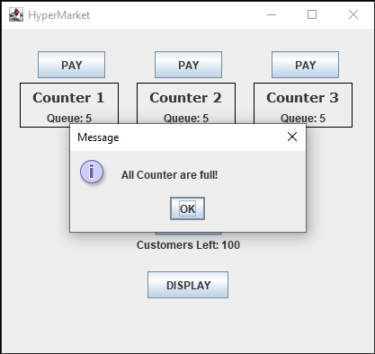
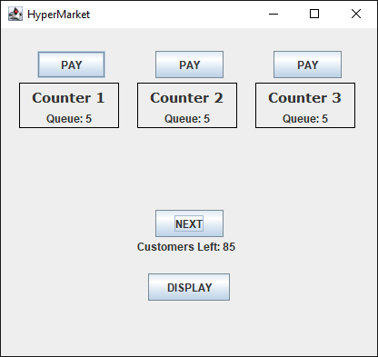
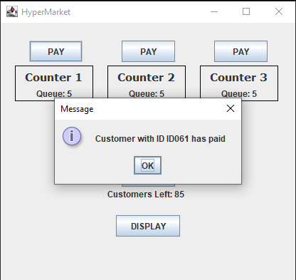
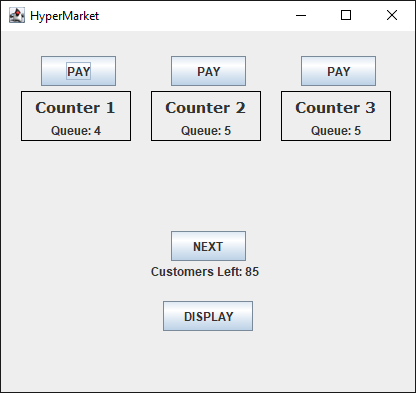
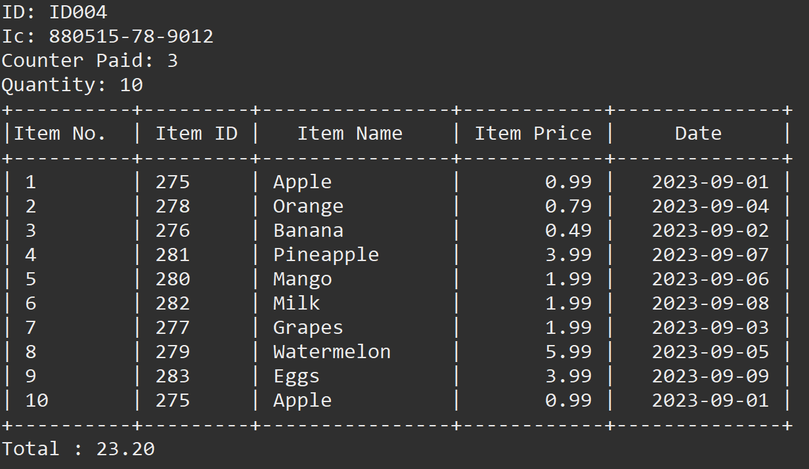

# PROJECT-SWC3344-0423
## The Frame once run

## Functionality
| Button | Function |
|---|---|
| | Adds new customer to the queue. |
| | Removes the selected customer from the queue. |
| | Displays the list of customers that already paid. |

### Next Button

### Pay Button

### Display Button

